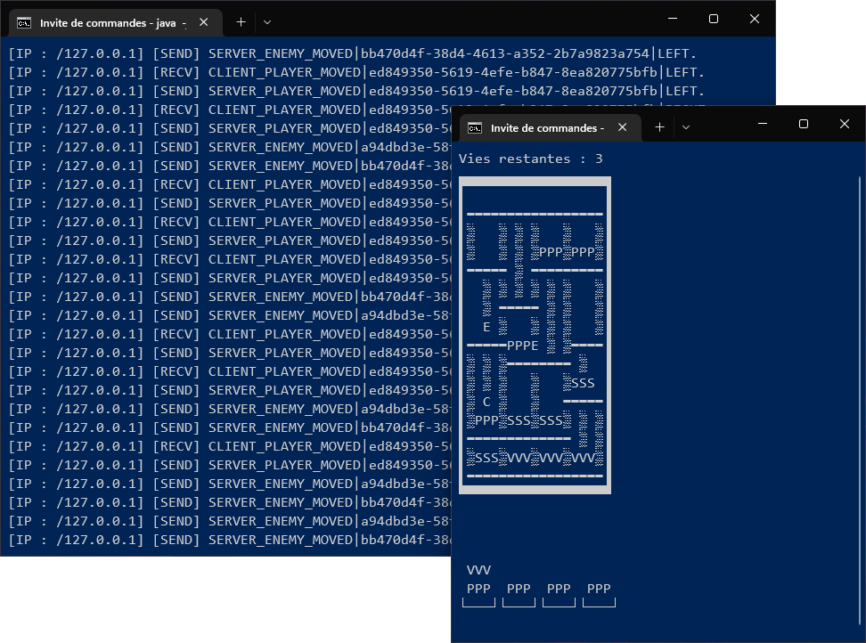

<!-- PROJECT LOGO -->
 

  <h3 align="center">BurgerTime</h3>
  

    <a href="#">View Demo (TODO)</a> ·
    <a href="https://github.com/Akwd22/contact-manager/releases/latest">Get latest release</a>
  

<!-- TABLE OF CONTENTS -->

  
Table of Contents

  <ol>
    <li><a href="#about-the-project">About The Project</a></li>
    <li><a href="#built-with">Built With</a></li>
    <li><a href="#documentation">Documentation</a></li>
    <li><a href="#getting-started">Getting Started</a></li>
    <li><a href="#usage">Usage</a></li>
    <li><a href="#contributors">Contributors</a></li>
    <li><a href="#acknowledgments">Acknowledgments</a></li>
  </ol>

<!-- ABOUT THE PROJECT -->
## About The Project

  

 

This project is the reproduction of the 80's video game [BurgerTime](https://en.wikipedia.org/wiki/BurgerTime) playable in multiplayer (LAN or Internet).

> The object of the game is to complete a number of hamburgers while avoiding enemy foods.
>
> Each board consists of a maze of planks and ladders in which giant burger ingredients (buns, patties, lettuce/tomato, etc.) are laid out. When the player walks the full length of an ingredient, it falls to the level below, knocking down any ingredient that happens to be there. A burger is completed when all of its vertically aligned ingredients have been dropped out of the maze and onto a waiting plate, and the player must complete all burgers to finish the board.
>
> *From [Wikipedia](https://en.wikipedia.org/wiki/BurgerTime#Gameplay).*

(<a href="#top">back to top</a>)

## Built With

Entire project was built with Java.

(<a href="#top">back to top</a>)

<!-- DOCUMENTATION -->
## Documentation

**Case symbols meaning:**

`P` : Bread.  
`S` : Lettuce.  
`V` : Meat.  
`E` : Enemy.  
`Other letter` : Player.  

`▒` : Ladder.  
`▬` : Walkable floor.

(<a href="#top">back to top</a>)

<!-- GETTING STARTED -->
## Getting Started

If you don't want to compile, you can [get latest binaries](https://github.com/Akwd22/burger-time/releases/latest).

<!-- USAGE EXAMPLES -->
## Usage

To play the game, you have to run a server (game), while clients (human players) connect to it.

1. Start the server: run the executable and select option 1.  
2. Start one or more clients (on the same machine or not): run the same executable but select option 2.  
   On the login screen, you must type the IP address (`127.0.0.1` if the server is on the same machine) of the server to connect.

*Note: if you want to play on the Internet, you must open the TCP port `25565` on your firewall.*

(<a href="#top">back to top</a>)

<!-- Contributors -->
## Contributors

This project was made by:
- [Eddy D.](https://github.com/Akwd22)
- [Clément G.](https://github.com/Zoreph22)
- [Lancelot D.](https://github.com/LancelotDucoeur)

(<a href="#top">back to top</a>)

<!-- ACKNOWLEDGMENTS -->
## Acknowledgments

* [Java Native Access](https://github.com/java-native-access/jna) library to be able to capture the keyboard keys without pressing <kbd>Enter</kbd>.

(<a href="#top">back to top</a>)

